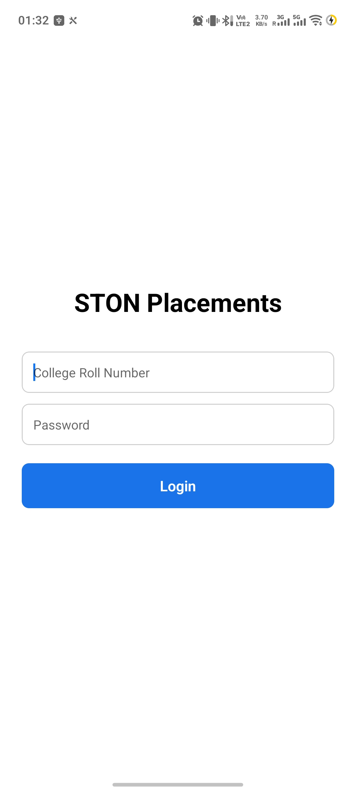
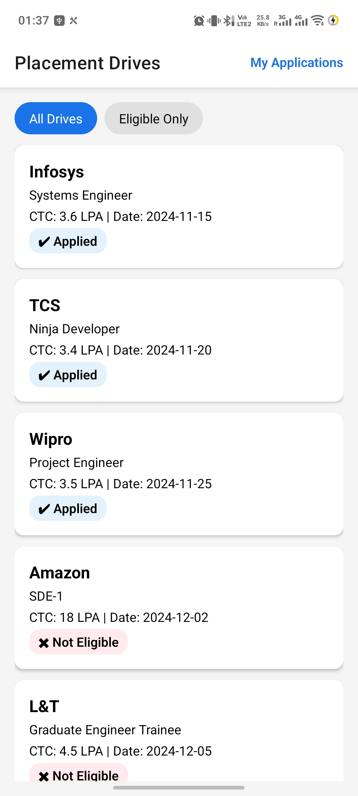
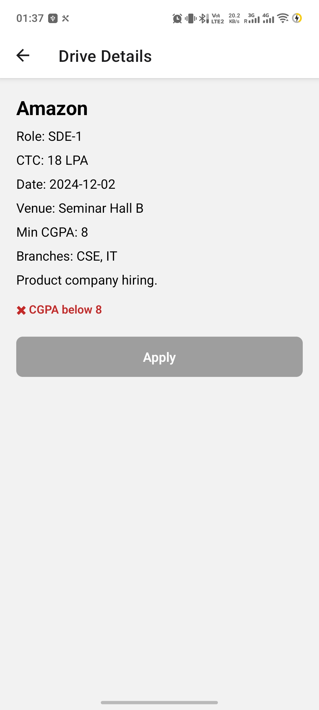
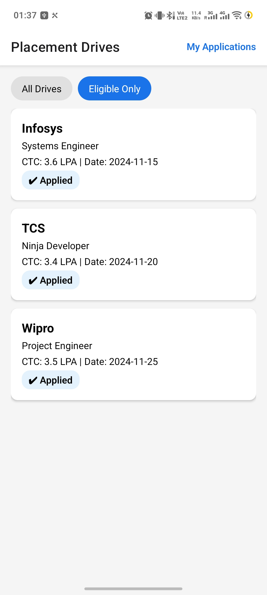
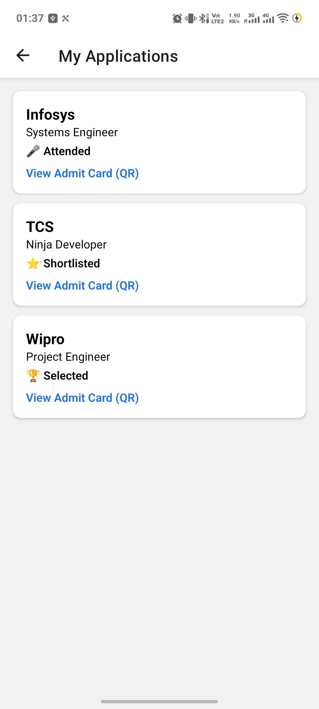
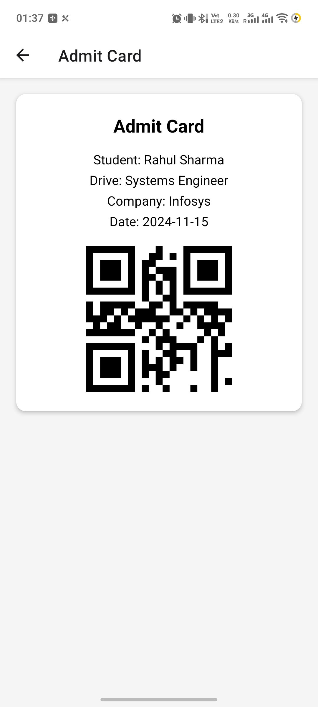

# STON Placement App

A student-facing placement management module built for STON Technology's React Native hiring assignment. It covers the full student journey — browsing placement drives, checking eligibility, applying, and tracking application status. It also includes a mock backend API and a CI pipeline.

## Features

- **Login** with roll number and password, with inline validation and a simulated loading state
- **Drive Listing** with eligibility badges and a filter for eligible-only drives
- **Drive Detail & Apply**, with eligibility reasons shown for ineligible drives and applied state reflected back on the listing
- **My Applications**, showing status (Applied / Attended / Shortlisted / Selected) with icon-based indicators
- **QR Admit Card** (bonus) generated from the applied drive

## Tech Stack

- React Native (Expo), React Navigation, React Context for state
- Node.js + Express mock API with JWT-based auth
- ESLint + Prettier, Jest for unit tests
- GitHub Actions for lint, test, build, and server checks

## Getting Started

```bash
git clone https://github.com/Jayant134/ston-assignment-jayant.git
cd ston-assignment-jayant
npm install
npx expo install --fix
```

**Run the app:**
```bash
npx expo start
```
Scan the QR code with Expo Go, or press `a` for an Android emulator. Log in with roll number `21CS001` and password `student123`.

**Run the mock server** (separate terminal):
```bash
npm run server
```
Runs on `http://localhost:3000`.

**Run tests and lint:**
```bash
npm test
npm run lint
```

## API Reference

Login returns a token; send it as `Authorization: Bearer <token>` on the rest.

| Method | Endpoint | Description |
|---|---|---|
| POST | `/api/auth/login` | Returns a mock JWT |
| GET | `/api/drives` | List all drives |
| GET | `/api/drives/:id` | Single drive detail |
| GET | `/api/drives/:id/eligibility` | Check eligibility |
| POST | `/api/drives/:id/apply` | Apply to a drive |
| GET | `/api/students/me/applications` | Application history |
| GET | `/api/health` | Basic health check (no auth) |

All responses follow a `{ success, data, message }` / `{ success, error: { code, message } }` envelope.

## Assumptions & Design Decisions

- Eligibility checks CGPA first, then branch, so the shown reason is the first rule that fails.
- Applied state lives in React Context so the listing, detail, and applications screens always agree; it resets on app restart, since only the session needs to persist per the brief.
- The mobile app runs entirely on local mock data and doesn't call the server, as allowed by the assignment.
- Server data is in-memory and resets on restart.

## Screenshots

| Login | Drive Listing | Drive Detail |
|---|---|---|
|  |  |  |

| Eligible Drives | My Applications | Admit Card |
|---|---|---|
|  |  |  | 
